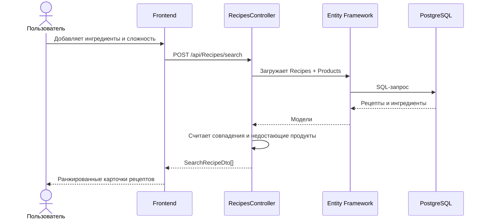
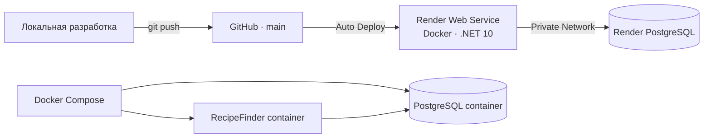
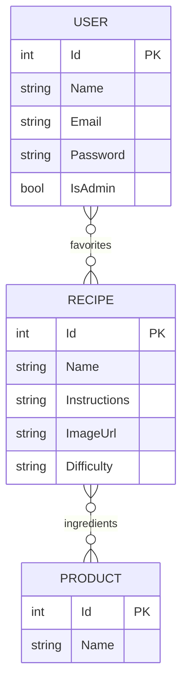

# 🍳 RecipeFinder

<div align="center">

### Найди рецепт из продуктов, которые уже есть дома

RecipeFinder подбирает блюда по ингредиентам, показывает недостающие продукты<br/>
и сохраняет любимые рецепты отдельно для каждого пользователя.

[](https://recipefinder-s9co.onrender.com)
[](https://dotnet.microsoft.com/)
[](https://www.postgresql.org/)
[](https://www.docker.com/)

</div>

> [!NOTE]
> Демо размещено на бесплатном Render. После периода бездействия первый запуск может занять до 50 секунд.

## ✨ Возможности

- 🔎 Поиск рецептов по одному или нескольким ингредиентам
- 📊 Сортировка по числу совпавших продуктов
- 🧾 Отображение имеющихся и недостающих ингредиентов
- 🎚️ Фильтрация по сложности: `easy`, `medium`, `hard`
- ❤️ Персональное избранное для каждого пользователя
- 👤 Регистрация, вход и выход из аккаунта
- 🥕 Каталог продуктов с количеством подходящих рецептов
- 📖 Подробные инструкции приготовления
- 🌓 Светлая и тёмная темы
- 🐳 Запуск приложения и PostgreSQL через Docker Compose
- 🚀 Автоматический деплой из GitHub на Render

## 🧱 Архитектура


### Поток поиска



### Схема развёртывания



## 🗃️ Модель данных



`Recipe ↔ Product` и `User ↔ Recipe` — связи many-to-many, которые EF Core хранит в промежуточных таблицах.

## 🧰 Технологии

| Слой | Технологии |
|---|---|
| Backend | ASP.NET Core 10, C# |
| ORM | Entity Framework Core 10 |
| Database | PostgreSQL 16, Npgsql |
| Frontend | HTML5, CSS3, Vanilla JavaScript |
| API | REST, JSON, Swagger / OpenAPI |
| Infrastructure | Docker, Docker Compose |
| Hosting | Render Web Service + Render PostgreSQL |

## 📁 Структура проекта

```text
RecipeFinder/
├── Controllers/
│   └── RecipesController.cs        # REST API
├── Data/
│   ├── AppDbContext.cs             # EF Core context
│   ├── DbSeeder.cs                 # Синхронизация каталога с БД
│   ├── RecipeCatalog.cs            # Начальный каталог рецептов
│   └── Migrations/                 # Миграции PostgreSQL
├── Models/
│   ├── Recipe.cs
│   ├── Product.cs
│   ├── User.cs
│   └── *Request.cs                 # DTO входящих запросов
├── wwwroot/
│   ├── index.html                  # Поиск и рекомендации
│   ├── products.html               # Каталог продуктов
│   ├── favorites.html              # Избранное пользователя
│   ├── authorization.html          # Вход и регистрация
│   ├── css/site.css
│   └── js/
│       ├── app.js
│       ├── auth.js
│       ├── authorization.js
│       ├── favorites.js
│       └── products.js
├── Dockerfile
├── docker-compose.yml
├── Program.cs
└── RecipeFinder.csproj
```

## 🔌 API

Базовый адрес: `/api/Recipes`

| Метод | Endpoint | Назначение |
|---|---|---|
| `GET` | `/api/Recipes?userId={id}` | Получить все рецепты |
| `GET` | `/api/Recipes/products` | Получить каталог продуктов |
| `GET` | `/api/Recipes/favorites?userId={id}` | Избранное пользователя |
| `POST` | `/api/Recipes/search` | Найти рецепты по ингредиентам |
| `POST` | `/api/Recipes/{id}/favorite` | Добавить или убрать рецепт из избранного |
| `POST` | `/api/Recipes/registration` | Зарегистрировать пользователя |
| `POST` | `/api/Recipes/authorization` | Выполнить вход |

<details>
<summary><b>Пример запроса поиска</b></summary>

```http
POST /api/Recipes/search
Content-Type: application/json

{
  "products": ["яйца", "молоко", "сыр"],
  "difficulty": "all",
  "userId": 1
}
```

В ответе для каждого рецепта возвращаются:

- `haveProducts` — найденные ингредиенты;
- `missingProducts` — недостающие ингредиенты;
- `matchCount` и `totalCount` — количество совпадений;
- `hasAllIngredients` — достаточно ли выбранных продуктов;
- `isFavorite` — находится ли рецепт в избранном пользователя.

</details>

<details>
<summary><b>Пример переключения избранного</b></summary>

```http
POST /api/Recipes/12/favorite
Content-Type: application/json

{
  "userId": 1
}
```

</details>

## 🚀 Быстрый запуск через Docker

### Требования

- [Docker Desktop](https://www.docker.com/products/docker-desktop/)
- Docker Compose

### Запуск

```bash
cp .env.example .env
docker compose up --build -d
```

После запуска:

- приложение: [http://localhost:8080](http://localhost:8080);
- PostgreSQL с хоста: `localhost:5433`;
- внутри Docker-сети база доступна как `db:5432`.

Проверить контейнеры:

```bash
docker compose ps
```

Остановить:

```bash
docker compose down
```

Удалить контейнеры вместе с данными БД:

```bash
docker compose down -v
```

## 💻 Запуск без Docker

### Требования

- [.NET 10 SDK](https://dotnet.microsoft.com/download)
- PostgreSQL

Укажи строку подключения через `appsettings.Development.json` или переменную окружения:

```text
ConnectionStrings__DefaultConnection=Host=localhost;Port=5432;Database=recipe_finder;Username=postgres;Password=YOUR_PASSWORD
```

Запусти приложение:

```bash
dotnet restore
dotnet run --launch-profile RecipeFinder
```

Локальный адрес: [http://localhost:5080](http://localhost:5080).

При запуске приложение автоматически:

1. применяет EF Core migrations;
2. создаёт необходимые таблицы;
3. добавляет и обновляет каталог рецептов через `DbSeeder`.

## ☁️ Деплой на Render

Проект уже настроен для автоматического деплоя:

1. изменения отправляются в ветку `main`;
2. Render собирает образ по `Dockerfile`;
3. приложение запускается на порту `10000`;
4. строка подключения передаётся через `ConnectionStrings__DefaultConnection`;
5. после успешного запуска миграции применяются автоматически.

```bash
git add .
git commit -m "Describe your changes"
git push
```

Live-версия: **https://recipefinder-s9co.onrender.com**

## ⚠️ Важно для production

Текущая авторизация сделана в учебных целях. Перед реальным production-запуском необходимо:

- хранить пароли только в виде безопасного хеша (`PasswordHasher`, Argon2 или BCrypt);
- заменить передачу `userId` клиентом на cookie-сессию или JWT;
- добавить валидацию DTO и ограничение частоты запросов;
- не хранить секреты в Git — использовать переменные окружения;
- настроить HTTPS, резервные копии БД и ротацию credentials.

## 🛣️ Идеи для развития

- [ ] JWT или cookie-аутентификация
- [ ] Хеширование паролей
- [ ] Панель администратора для управления рецептами
- [ ] Загрузка собственных изображений
- [ ] Пагинация и полнотекстовый поиск
- [ ] Оценки и комментарии пользователей
- [ ] Автоматические тесты и CI

---

<div align="center">

Сделано на **ASP.NET Core**, **PostgreSQL** и **Vanilla JavaScript**

</div>
