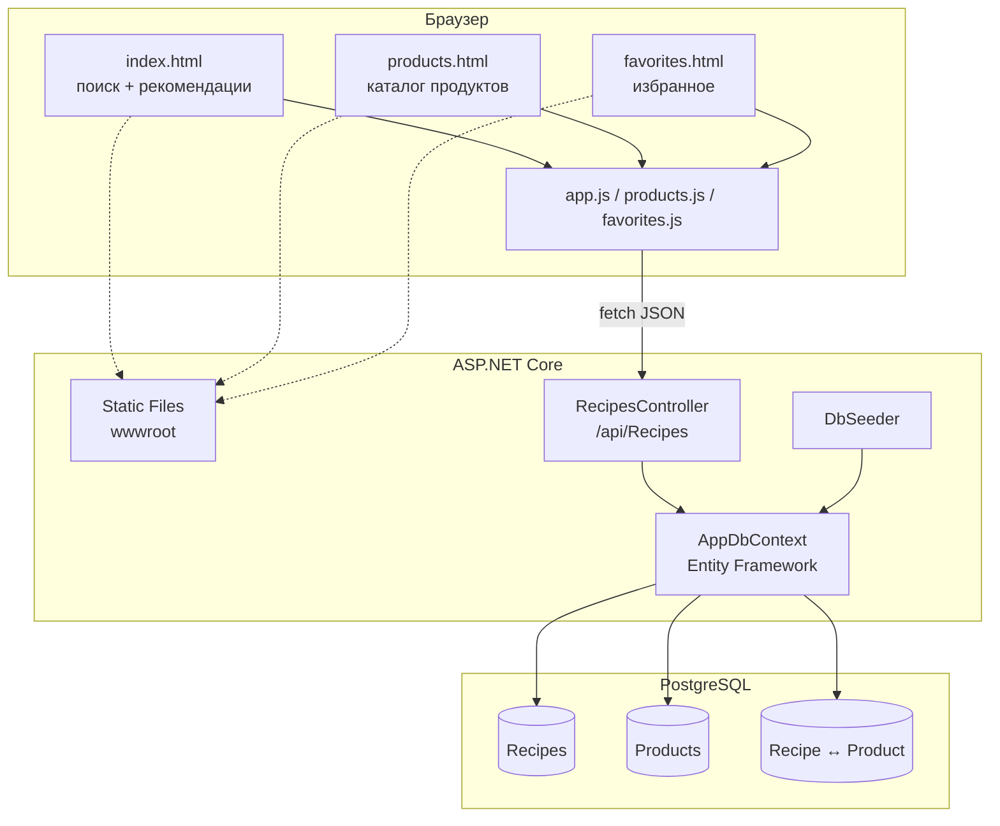
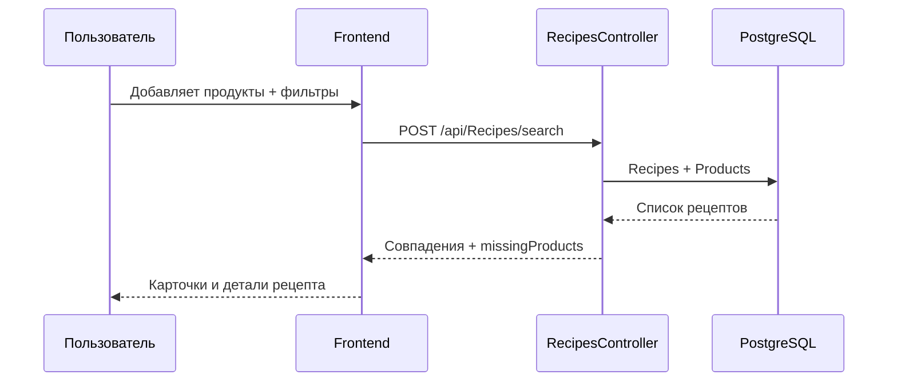
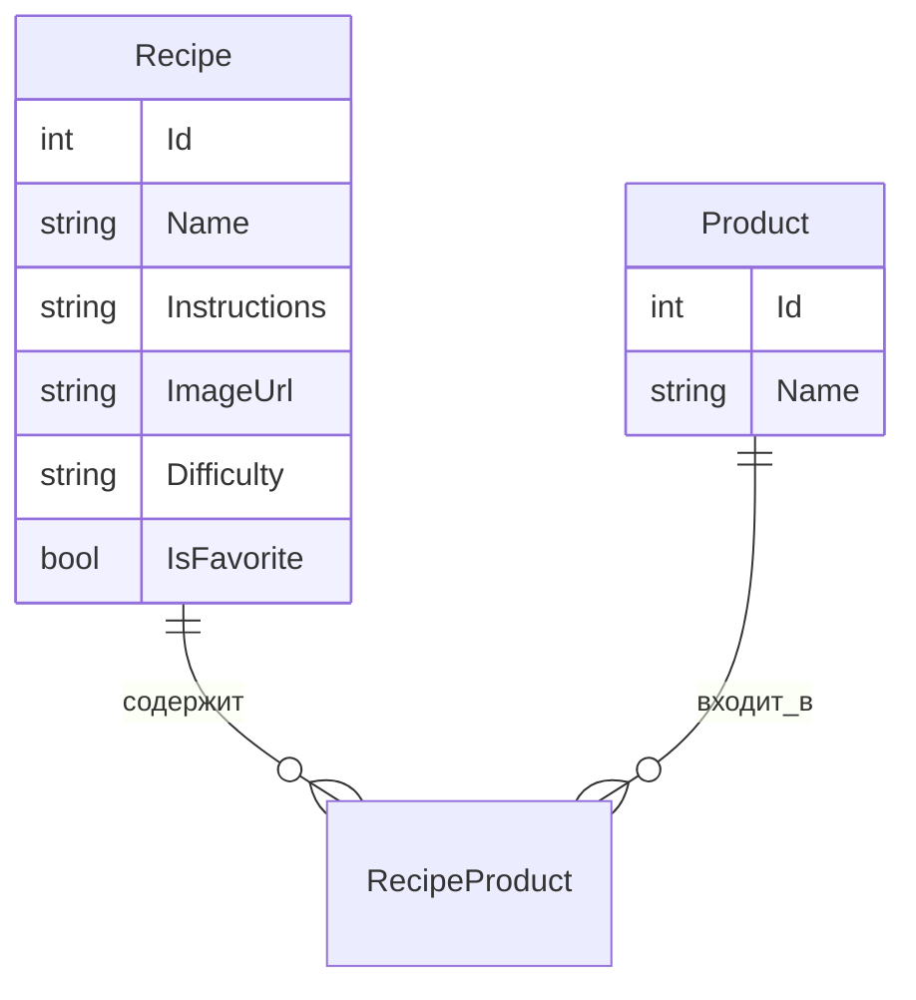

# RecipeFinder

> Введи продукты из холодильника — найди, что можно приготовить.

Веб-приложение на **ASP.NET Core** + **PostgreSQL**: поиск рецептов по ингредиентам, фильтр сложности, избранное в БД и каталог продуктов.

---

## Схема проекта



---

## Как работает поиск



---

## Модель данных



| Сущность | Поля |
|----------|------|
| **Recipe** | название, шаги, картинка, сложность (`easy` / `medium` / `hard`), избранное |
| **Product** | название ингредиента |
| Связь | many-to-many: рецепт ↔ продукты |

---

## Структура папок

```text
RecipeFinder/
├── Controllers/
│   └── RecipesController.cs     # API
├── Models/
│   ├── Recipe.cs
│   ├── Product.cs
│   └── RecipeSearchRequest.cs
├── Data/
│   ├── AppDbContext.cs
│   ├── DbSeeder.cs
│   └── Migrations/
├── wwwroot/
│   ├── index.html               # Главная
│   ├── products.html            # Продукты
│   ├── favorites.html           # Избранное
│   ├── css/site.css
│   └── js/
│       ├── app.js
│       ├── products.js
│       └── favorites.js
├── Program.cs
└── README.md
```

---

## API

| Метод | URL | Описание |
|-------|-----|----------|
| `GET` | `/api/Recipes` | Все рецепты |
| `GET` | `/api/Recipes/products` | Все продукты |
| `GET` | `/api/Recipes/favorites` | Избранные рецепты |
| `POST` | `/api/Recipes/{id}/favorite` | Вкл / выкл избранное |
| `POST` | `/api/Recipes/search` | Поиск по продуктам + сложность |

Пример поиска:

```http
POST /api/Recipes/search
Content-Type: application/json

{
  "products": ["яйца", "молоко", "соль"],
  "difficulty": "all"
}
```

Ответ содержит `haveProducts`, `missingProducts`, `hasAllIngredients` и `matchCount`.

---

## Страницы

| Страница | Что умеет |
|----------|-----------|
| `/` | Поиск, теги, фильтры, рекомендации, детали рецепта |
| `/products.html` | Каталог всех продуктов из БД |
| `/favorites.html` | Рецепты с `IsFavorite = true` |
| `/swagger` | Документация API (в Development) |

---

## Запуск

### Требования

- [.NET 10 SDK](https://dotnet.microsoft.com/download)
- PostgreSQL

### Строка подключения

В `appsettings.Development.json` (или `appsettings.json`):

```json
{
  "ConnectionStrings": {
    "DefaultConnection": "Host=localhost;Port=5432;Database=recipe_finder;Username=postgres;Password=YOUR_PASSWORD"
  }
}
```

### Команды

```bash
dotnet ef database update
dotnet run --launch-profile RecipeFinder
```

Открой: **http://localhost:5080/**

При старте приложение само применяет миграции и заполняет тестовые рецепты через `DbSeeder`.

---

## Стек


- **Backend:** ASP.NET Core Web API  
- **ORM:** Entity Framework Core + Npgsql  
- **Frontend:** HTML / CSS / Vanilla JS (`wwwroot`)  
- **API docs:** Swashbuckle (Swagger)

---

## Возможности

- Частичный матч продуктов: показываем, чего не хватает  
- Фильтр по сложности и доп. фильтры на фронте  
- Избранное хранится в PostgreSQL  
- Каталог продуктов с переходом в поиск  
- Тёмная / светлая тема
