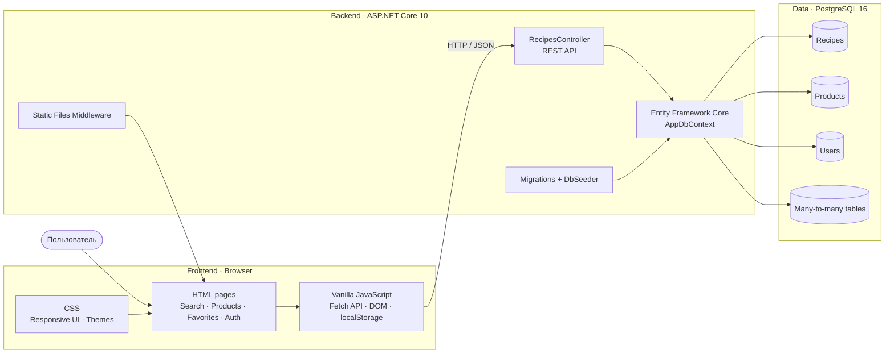
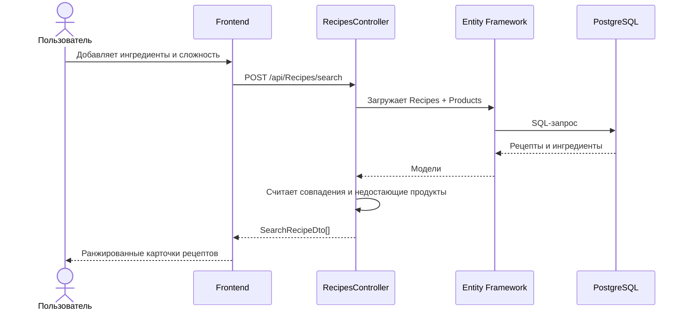
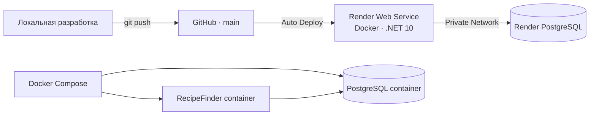
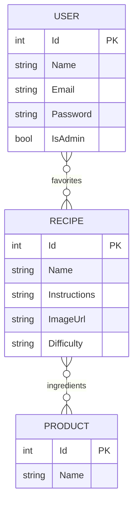

# RecipeFinder

Веб-приложение для подбора рецептов по продуктам, которые уже есть дома. Показывает, каких ингредиентов не хватает, позволяет фильтровать по сложности и сохранять рецепты в избранное для каждого пользователя.

Демо: https://recipefinder-s9co.onrender.com (бесплатный тариф Render, после простоя первый запрос может идти до 50 секунд).

Стек: ASP.NET Core 10, Entity Framework Core, PostgreSQL, ванильный JavaScript на фронтенде, Docker Compose для локального запуска.

## Содержание

- [Возможности](#возможности)
- [Архитектура](#архитектура)
- [Модель данных](#модель-данных)
- [Структура проекта](#структура-проекта)
- [API](#api)
- [Запуск через Docker](#запуск-через-docker)
- [Запуск без Docker](#запуск-без-docker)
- [Деплой на Render](#деплой-на-render)
- [Важно перед production](#важно-перед-production)
- [Тесты](#тесты)
- [Контрибьютинг](#контрибьютинг)
- [Идеи для развития](#идеи-для-развития)

## Возможности

- Поиск рецептов по одному или нескольким ингредиентам
- Ранжирование результатов по числу совпавших продуктов
- Список имеющихся и недостающих ингредиентов для каждого рецепта
- Фильтр по сложности: `easy`, `medium`, `hard`
- Персональное избранное для каждого пользователя
- Регистрация, вход и выход из аккаунта
- Каталог продуктов с числом подходящих рецептов
- Подробные инструкции приготовления
- Светлая и тёмная тема интерфейса
- Запуск приложения и PostgreSQL через Docker Compose
- Автоматический деплой из GitHub на Render

## Архитектура



### Поток поиска



### Схема развёртывания



## Модель данных



`Recipe ↔ Product` и `User ↔ Recipe` — связи many-to-many, EF Core хранит их в промежуточных таблицах.

| Слой | Технологии |
|---|---|
| Backend | ASP.NET Core 10, C# |
| ORM | Entity Framework Core 10 |
| Database | PostgreSQL 16, Npgsql |
| Frontend | HTML5, CSS3, Vanilla JavaScript |
| API | REST, JSON, Swagger / OpenAPI |
| Infrastructure | Docker, Docker Compose |
| Hosting | Render Web Service + Render PostgreSQL |

## Структура проекта

```text
RecipeFinder/
├── Controllers/
│   └── RecipesController.cs        # REST API
├── Data/
│   ├── AppDbContext.cs             # EF Core context
│   ├── DbSeeder.cs                 # Синхронизация каталога с БД
│   ├── RecipeCatalog.cs            # Начальный каталог рецептов
│   └── Migrations/                 # Миграции PostgreSQL
├── Models/
│   ├── Recipe.cs
│   ├── Product.cs
│   ├── User.cs
│   └── *Request.cs                 # DTO входящих запросов
├── wwwroot/
│   ├── index.html                  # Поиск и рекомендации
│   ├── products.html               # Каталог продуктов
│   ├── favorites.html              # Избранное пользователя
│   ├── authorization.html          # Вход и регистрация
│   ├── css/site.css
│   └── js/
│       ├── app.js
│       ├── auth.js
│       ├── authorization.js
│       ├── favorites.js
│       └── products.js
├── Dockerfile
├── docker-compose.yml
├── Program.cs
└── RecipeFinder.csproj
```

## API

Базовый адрес: `/api/Recipes`

| Метод | Endpoint | Назначение |
|---|---|---|
| `GET` | `/api/Recipes?userId={id}` | Получить все рецепты |
| `GET` | `/api/Recipes/products` | Получить каталог продуктов |
| `GET` | `/api/Recipes/favorites?userId={id}` | Избранное пользователя |
| `POST` | `/api/Recipes/search` | Найти рецепты по ингредиентам |
| `POST` | `/api/Recipes/{id}/favorite` | Добавить или убрать рецепт из избранного |
| `POST` | `/api/Recipes/registration` | Зарегистрировать пользователя |
| `POST` | `/api/Recipes/authorization` | Выполнить вход |

<details>
<summary>Пример запроса поиска</summary>

```http
POST /api/Recipes/search
Content-Type: application/json

{
  "products": ["яйца", "молоко", "сыр"],
  "difficulty": "all",
  "userId": 1
}
```

В ответе для каждого рецепта возвращаются:

- `haveProducts` — найденные ингредиенты
- `missingProducts` — недостающие ингредиенты
- `matchCount` и `totalCount` — количество совпадений
- `hasAllIngredients` — достаточно ли выбранных продуктов
- `isFavorite` — находится ли рецепт в избранном пользователя

</details>

<details>
<summary>Пример переключения избранного</summary>

```http
POST /api/Recipes/12/favorite
Content-Type: application/json

{
  "userId": 1
}
```

</details>

## Запуск через Docker

Требуется [Docker Desktop](https://www.docker.com/products/docker-desktop/) с Docker Compose.

```bash
cp .env.example .env
docker compose up --build -d
```

После запуска:

- приложение: http://localhost:8080
- PostgreSQL с хоста: `localhost:5433`
- внутри Docker-сети база доступна как `db:5432`

Проверить контейнеры:

```bash
docker compose ps
```

Остановить:

```bash
docker compose down
```

Остановить и удалить данные БД:

```bash
docker compose down -v
```

## Запуск без Docker

Требуется [.NET 10 SDK](https://dotnet.microsoft.com/download) и PostgreSQL.

Строка подключения задаётся через `appsettings.Development.json` или переменную окружения:

```text
ConnectionStrings__DefaultConnection=Host=localhost;Port=5432;Database=recipe_finder;Username=postgres;Password=YOUR_PASSWORD
```

Запуск:

```bash
dotnet restore
dotnet run --launch-profile RecipeFinder
```

Локальный адрес: http://localhost:5080

При старте приложение автоматически применяет EF Core migrations, создаёт таблицы и заполняет каталог рецептов через `DbSeeder`.

## Деплой на Render

Проект настроен на автоматический деплой: пуш в `main` запускает сборку по `Dockerfile`, приложение поднимается на порту `10000`, строка подключения передаётся через `ConnectionStrings__DefaultConnection`, миграции применяются автоматически после старта.

```bash
git add .
git commit -m "Describe your changes"
git push
```

Live-версия: https://recipefinder-s9co.onrender.com

## Важно перед production

Текущая авторизация сделана в учебных целях. Перед реальным production-запуском нужно:

- хранить пароли только в виде хеша (`PasswordHasher`, Argon2 или BCrypt), а не в открытом виде
- заменить передачу `userId` клиентом на cookie-сессию или JWT
- добавить валидацию DTO и ограничение частоты запросов
- не хранить секреты в Git — использовать переменные окружения
- настроить HTTPS, резервные копии БД и ротацию credentials

Эти места в коде помечены комментариями `SECURITY:` — см. `RecipesController.cs`, `Models/User.cs`, `wwwroot/js/auth.js`.

## Тесты

Автоматических тестов пока нет. План для первого захода:

1. Завести тестовый проект: `dotnet new xunit -n RecipeFinder.Tests`, подключить его в решение.
2. Начать с юнит-тестов на чистую логику без БД: ранжирование результатов в `RecipesController.SearchByProducts` (порядок по `HasAllIngredients` → `MatchCount` → недостающим продуктам) и разбор ингредиентов в `wwwroot/js/app.js`.
3. Для эндпоинтов, завязанных на БД (`GetFavorites`, `ToggleFavorite`, `Registration`, `Authorization`), использовать `Microsoft.EntityFrameworkCore.InMemory` вместо реального PostgreSQL.
4. Покрыть граничные случаи: пустой список продуктов при поиске, несуществующий `userId`, повторная регистрация с занятым email.
5. Подключить `dotnet test` в CI.

## Контрибьютинг

1. Форкнуть репозиторий, склонировать себе.
2. Поднять проект через Docker (`docker compose up --build`) — быстрее всего для локальной работы.
3. Завести отдельную ветку под задачу: `git checkout -b feature/short-description`.
4. Открыть PR с описанием, что изменилось и зачем. Список ниже — источник задач для первого PR.
5. Небольшой PR на один пункт из списка — уже нормальный вклад, не обязательно делать всё сразу.

## Идеи для развития

- [ ] JWT или cookie-аутентификация
- [ ] Хеширование паролей
- [ ] Панель администратора для управления рецептами
- [ ] Загрузка собственных изображений
- [ ] Пагинация и полнотекстовый поиск
- [ ] Оценки и комментарии пользователей
- [ ] Автоматические тесты (xUnit + EF Core InMemory) и CI с `dotnet test`
- [ ] Удалить или переиспользовать неиспользуемый `GET /api/Recipes/recipes` в `RecipesController`
